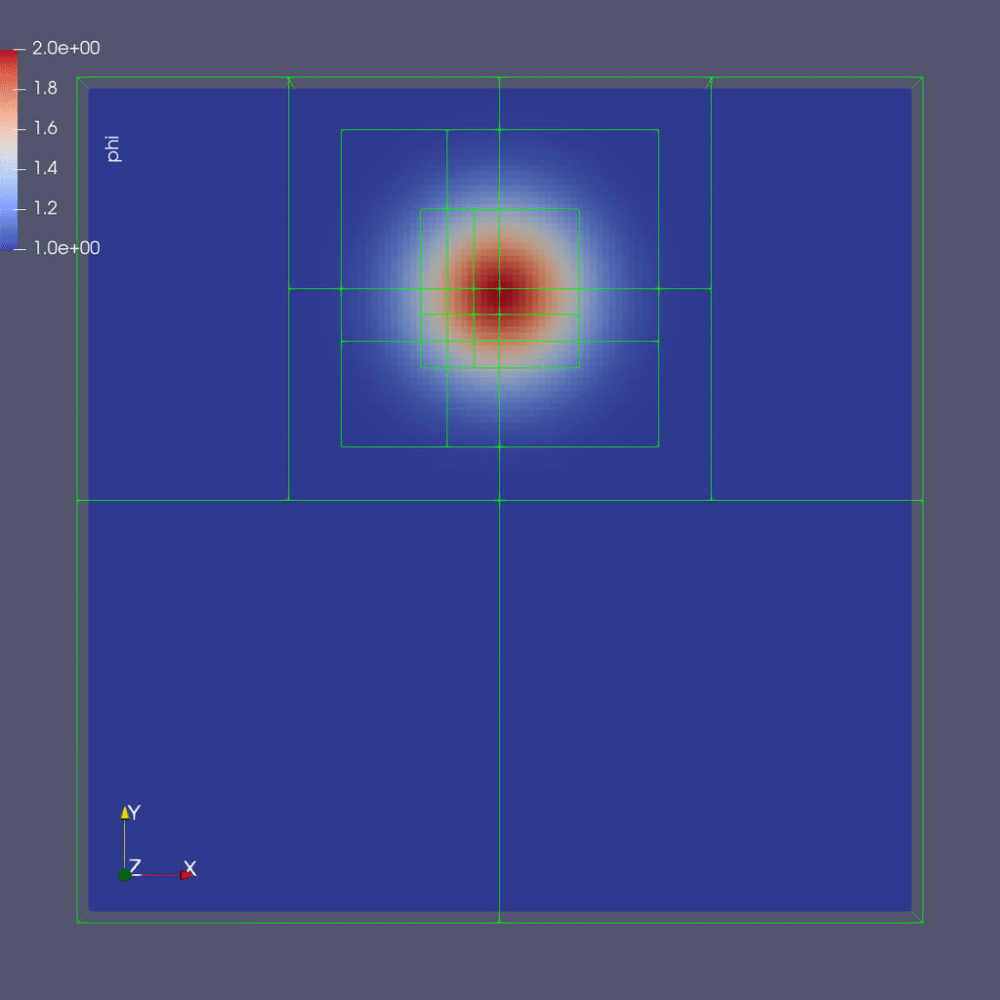

..
   ## At a Glance

   |Questions|Objectives|Key Points|
   |What can I do with AMReX?|Understand that "AMR" means more than just "traditional AMR"|AMR + EB + Particles|
   |How do I get started?|Understand easy set-up|It's not hard to get started|
   |What time-stepping do I use?|Understand the difference between subcycling and not|It's a choice|
   |How do I visualize AMR results?|Use Visit and Paraview for AMReX vis|Visualization tools exist for AMR data.|

.. _tutorial_advection:

Tutorial: Multi-Level Scalar Advection
=======================================

.. admonition:: **Time to Complete**: 20 mins
   :class: warning

   Features:

     - Mesh Data
     - Dynamic Adaptive Mesh Refinement (AMR)
     - Subcycling

Background
----------

Consider a drop of dye (we'll define :math:`\phi` to be the concentration of dye)
in a thin incompressible fluid that is spinning
clock-wise then counter-clockwise with a prescribed motion.  We consider the dye to be a
passive tracer that is advected by the fluid velocity.  The fluid is thin enough that we can model
this as two-dimensional motion; here we have the option of solving in a 2D or 3D computational domain.

In other words, we want to solve for :math:`\phi(x,y,t)` by evolving

.. math::

   \frac{\partial \phi}{\partial t} + \nabla \cdot (\bf{u^{spec}} \phi)  = 0

in time (:math:`t`), where the velocity :math:`{\bf{u^{spec}}} = (u,v)w` is a divergence-free field computed by defining

.. math::

   \psi(i,j) = \sin^2(\pi x) \sin^2(\pi y)  \cos (\pi t / 2) / \pi

and defining

.. math::

   u = -\frac{\partial \psi}{\partial y},  v = \frac{\partial \psi}{\partial x}.

Note that because :math:`{\bf{u^{spec}}}` is defined as the curl of a scalar field, it is analytically divergence-free.

In this example we'll be using AMR to resolve the scalar field since the location of the dye is
what we care most about.

Terminology
-----------

  - Grid
  - Level
  - Patch

The AMR Algorithm
-----------------

To update the solution in a patch at a given level, we compute fluxes (:math:`{\bf u^{spec}} \phi`)
on each face, and difference the fluxes to create the update to :math:`\phi`. The update routine
in the code looks like:

.. code-block:: cpp

  // Do a conservative update
  {
    phi_out(i,j,k) = phi_in(i,j,k) +
                ( AMREX_D_TERM( (flxx(i,j,k) - flxx(i+1,j,k)) * dtdx[0],
                              + (flxy(i,j,k) - flxy(i,j+1,k)) * dtdx[1],
                              + (flxz(i,j,k) - flxz(i,j,k+1)) * dtdx[2] ) );
  }

In this routine we use the macro ``AMREX_D_TERM`` so that we can write dimension-independent code.
When compiled for 3D this returns the flux differences in all three directions, but for 2D it does not include
the z-fluxes.

Knowing how to resolve the solution at coarse-fine boundaries is essential in any AMR algorithm.

.. code-block:: cpp

   void
   AmrCoreAdv::timeStepNoSubcycling (Real time, int iteration)
   {
       DefineVelocityAllLevels(time);
       AdvancePhiAllLevels (time, dt[0], iteration);

       // Make sure the coarser levels are consistent with the finer levels
       AverageDown ();

       for (int lev = 0; lev <= finest_level; lev++)
           ++istep[lev];
   }

Subcycling
----------

AMReX includes subcycling in time functionality. Subcycling in time means taking multiple smaller time steps on
finer levels of the mesh than is taken at coarser levels. This allows finer meshes to not only be
more accurate due to increased spatial resolution, but also due to the use of smaller time steps
used in calculations. The trade-off is that we must ensure that data at all levels of the grid
synchronizes to the same time.

Characteristics of Subcycling and Non-Subcycling Approaches
^^^^^^^^^^^^^^^^^^^^^^^^^^^^^^^^^^^^^^^^^^^^^^^^^^^^^^^^^^^

**Non-Subcycling**:

  - Same `dt` on every grid and at every level.
  - Everyone operation can be done as a multi-level operation before proceeding to the next operation. For
    example, if solving an advection-diffusion-reaction system, the advection step completes on all grids
    at all levels before the diffusion step.

**Subcycling**:

  - The ratio `dt/dx` is typically kept constant.
  - Requires separating level advance computations from synchronization operations.
  - Can make algorithms substantially more complex.

..
   What about Time-Stepping?
   AMR doesn’t dictate the spatial or temporal discretization on a single patch, but we need to make sure
   the data at all levels gets to the same time.
   The main question is:
   To subcycle or not to subcycle?
   Subcycling in time means taking multiple time steps on finer levels relative to coarser levels.
   Non-subcycling:
   • Same dt on every grid at every level
   • Every operation can be done as a multi-level operation before proceeding to the next operation,
   e.g. if solving advection-diffusion-reaction system, we can complete the advection step on all
   grids at all levels before computing diffusion
   Subycling:
   • dt / dx usually kept constant
   • Requires separation of “level advance” from “synchronization operations”
   • Can make algorithms substantially more complicated

Knowing how to synchronize the solution at coarse/fine boundaries is essential in an AMR algorithm;
here having the algorithm written in flux form allows us to either make the fluxes consistent between
coarse and fine levels in a no-subcycling algorithm, or "reflux" after the update in a subcycling algorithm.

The subcycling algorithm can be written as follows:

.. code-block:: cpp

   void
   AmrCoreAdv::timeStepWithSubcycling (int lev, Real time, int iteration)
   {

       // Advance a single level for a single time step, and update flux registers
       Real t_nph = 0.5 * (t_old[lev] + t_new[lev]);
       DefineVelocityAtLevel(lev, t_nph);
       AdvancePhiAtLevel(lev, time, dt[lev], iteration, nsubsteps[lev]);

       ++istep[lev];

       if (lev < finest_level)
       {
           // recursive call for next-finer level
           for (int i = 1; i <= nsubsteps[lev+1]; ++i)
           {
               timeStepWithSubcycling(lev+1, time+(i-1)*dt[lev+1], i);
           }

           if (do_reflux)
           {
               // update lev based on coarse-fine flux mismatch
               flux_reg[lev+1]->Reflux(phi_new[lev], 1.0, 0, 0, phi_new[lev].nComp(), geom[lev]);
           }

           AverageDownTo(lev); // average lev+1 down to lev
       }

   }

Running the Code
-----------------

::

   cd {{site.handson_root}}/amrex/AMReX_Amr101/Exec

Note that you can choose to work entirely in 2D or in 3D ... whichever you prefer.
The instructions below will be written for 3D but you can substitute the 2D executable.

In this directory you'll see:

  - ``main2d.gnu.MPI.ex`` -- the 2D executable -- this has been built with MPI.

  - ``main3d.gnu.MPI.ex`` -- the 3D executable -- this has been built with MPI.

  - ``inputs`` -- an inputs file for both 2D and 3D.

To run in serial, type

::

   ./main3d.gnu.MPI.ex inputs

To run in parallel, for example on 4 ranks, type

::

   mpiexec -n 4 ./main3d.gnu.MPI.ex inputs

Inputs
------

The following parameters can be set at run-time -- these are currently set in the inputs
file but you can also set them on the command line.

::

   stop_time          =  2.0                # the final time (if we have not exceeded number of steps)
   max_step           = 1000000             # the maximum number of steps (if we have not exceeded stop_time)
   amr.n_cell         =  64  64   8         # number of cells at the coarsest AMR level in each coordinate direction
   amr.max_grid_size  = 16                  # the maximum number of cells in any direction in a single grid
   amr.plot_int       = 10                  # frequency of writing plotfiles
   adv.cfl            = 0.9                 # cfl number to be used for computing the time step
   adv.phierr = 1.01  1.1  1.5              # regridding criteria  at each level

The base grid here is a square of 64 x 64 x 8 cells, made up of 16 subgrids each of size 16x16x8 cells.
The problem is periodic in all directions.

We have hard-wired the code here to refine based on the magnitude of :math:`\phi`. Here we set the
threshold level by level.  If :math:`\phi > 1.01` then we want to refine at least once; if :math:`\phi > 1.1` we
want to resolve :math:`\phi` with two levels of refinement, and if :math:`\phi > 1.5` we want even more refinement.

Output
------

Note that you can see the total runtime by looking at the line at the end of your run that says

::

   Total Time:

and you can check conservation of :math:`\phi` by checking the line that prints, e.g.

::

   Coarse STEP 8 ends. TIME = 0.007031485953 DT = 0.0008789650903 Sum(Phi) = 540755.0014

Here ``Sum(Phi)`` is the sum of :math:`\phi` over all the cells at the coarsest level.

Questions to answer:
--------------------

   1. How do the subcycling vs no-subycling calculations compare?

       a.   How many steps did each take at the finest level? Why might this not be the same?

       b.   How many cells were at the finest level in each case? Why might this number not be the same?

   2  What was the total run time for each calculation?  Was this what you expected?

   3. Was phi conserved (over time) in each case?

         a.  If you set do_refluxing = 0 for the subcycling case, was phi still conserved?

         b.  How in the algorithm is conservation enforced differently between subcycling and not?

   4. How did the runtimes vary with 1 vs. 4 MPI processes?
      We suggest you use a big enough problem here -- try running

   ::

      mpiexec -n 1 ./main3d.gnu.MPI.ex inputs_for_scaling

      mpiexec -n 4 ./main3d.gnu.MPI.ex inputs_for_scaling

   5. Why could we check conservation by just adding up the values at the coarsest level?

Visualizing the Results
-----------------------

Here is a sample slice through a 3D run with 64x64x8 cells at the coarsest level and three finer levels (4 total levels).

After you run the code you will have a series of plotfiles.  To visualize these
we will use ParaView 5.8, which has native support for AMReX Grid, Particle,
and Embedded Boundary data (in the AMR 101 exercise we only have grid data).

Make a Movie with the ParaView 5.8 Script
-----------------------------------------

To use the ParaView 5.8 python script, simply do the following to generate ``amr101_3D.gif``:

::

  $ make movie3D

If you run the 2D executable, make the 2D movie using:

::

   $ make movie2D

.. note::

   - To delete old plotfiles before a new run, do ``rm -rf plt*``

   - You will need ``+ffmpeg`` in your ``~/.soft.cooley`` file. If you do not already have it, do ``soft add +ffmpeg`` and then ``resoft`` to load it.

   - You can do ``realpath amr101_3D.gif`` to get the movie's path on Cooley and then copy it to your local machine by doing `scp [username]@cooley.alcf.anl.gov:[path-to-gif] .`

Using ParaView 5.8 Manually
^^^^^^^^^^^^^^^^^^^^^^^^^^^

To do the same thing with ParaView 5.8 manually (if, e.g. you have the plotfiles on your local machine and want to experiment or if you connected ParaView 5.8 in client-server mode to Cooley):

  1. Start Paraview 5.8
  2. File --> Open ... and select the collection of directories named "plt.." --> [OK]
  3. From the "Open Data With..." dialog that pops up, select "AMReX/BoxLib Grid Reader" --> [OK]
  4. Check the "phi" box in the "Cell Array Status" menu that appears
  5. Click green Apply button
  6. Click on the "slice" icon -- three to the right of the calculator
     This will create "Slice 1" in the Pipeline Browser which will be highlighted.
  7. Click on "Z Normal"
  8. Unclick the "Show Plane" button
  9. Click green Apply button
  10. Change the drop-down menu option (above the calculator row) from "vtkBlockColors" to "phi"

You are now ready to play the movie!  See the "VCR-like" controls at the top. Click the play button.

Additional Topics to Explore
----------------------------

   * What happens as you change the max grid size for decomposition?

   * What happens as you change the refinement criteria (i.e. use different values of :math:`\phi`
     (You can edit these in inputs)

