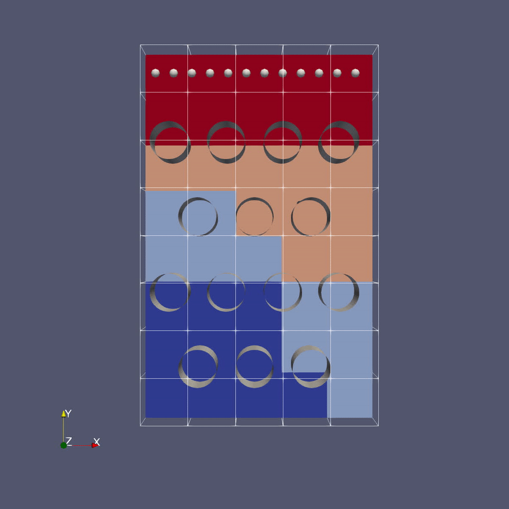

Advection of Particles Around Obstacles
=======================================

.. admonition:: Time to Complete
  :class: warning

    - Use of mesh data with embedded boundaries
    - Implementation of multigrid linear solver
    - Particle-Mesh interpolation

The Problem
-----------

Challenge:

Recall our previous problem of the drop of dye in a thin incompressible fluid that is spinning
clock-wise then counter-clockwise with a prescribed motion.

Now instead of advecting the dye as a scalar quantity defined on the mesh (the
continuum representation), we define the dye as a collection of particles that
are advected by the fluid velocity.

Again the fluid is thin enough that we can model this as two-dimensional
motion; again we have the option of solving in a 2D or 3D computational domain.

To make things even more interesting, there is now an object in the flow, in this case a cylinder.
It would be very difficult to analytically specify the flow field around the object, so instead
we project the velocity field so that the resulting field represents incompressible flow around the object.

Projecting the Velocity for Incompressible Flow around the Cylinder
--------------------------------------------------------------------

Mathematically, projecting the specified velocity field means solving

.. math::

    \nabla \cdot (\beta \nabla \xi)  = \nabla \cdot \bf{u^{spec}}

and setting

.. math::

    \bf{u} = \bf{u^{spec}} - \beta \nabla \xi

To solve this variable coefficient Poisson equation, we use the native AMReX geometric multigrid solver.
In our case :math:`\beta = 1 / \rho = 1` since we are assuming constant density :math:`\rho`.

Note that for this example we are solving everything at a single level for convenience,
but linear solvers, EB and particles all have full multi-level functionality.

In each timestep we compute the projected velocity field, advect the particles
with this velocity, then interpolate the particles onto the mesh to determine :math:`\phi(x,y,z)`.

Particle-In-Cell Algorithm for Advecting :math:`\phi`
-----------------------------------------------------

We achieve conservation by interpreting the scalar :math:`\phi` as the number
density of physical dye particles in the fluid, and we represent these physical
particles by "computational" particles :math:`p` Each particle :math:`p` stores a
weight :math:`w_p` equal to the number of physical dye particles it represents.

This allows us to define particle-mesh interpolation that converts
:math:`\phi(x,y,z)` to a set of particles with weights :math:`w_p` First, we
interpolate :math:`\phi(x,y,z)` to :math:`\phi_p` at each particle location by
calculating:

.. math::

    \phi_p = \sum_i \sum_j \sum_k S_x \cdot S_y \cdot S_z \cdot \phi(i,j,k)

where in the above, :math:`S_{x,y,z}` are called shape factors, determined by the
particle-in-cell interpolation scheme we wish to use.

The simplest interpolation is nearest grid point (NGP), where :math:`S_{x,y,z} = 1`
if the particle :math:`p` is within cell :math:`(i,j,k)` and :math:`S_{x,y,z} = 0`
otherwise. An alternative is linear interpolation called cloud-in-cell (CIC),
where the shape factors are determined by volume-weighting the particle's
contribution to/from the nearest 8 cells (in 3D).

Once we have interpolated :math:`\phi(x,y,z)` to the particle to get :math:`\phi_p` we
scale it by the volume per particle to get the number of physical dye particles
that our computational particle represents. Here, :math:`n_{ppc}` is the number of
computational particles per cell.

.. math::

    w_p = \phi_p \cdot \dfrac{dx dy dz}{n_{ppc}}

To go back from the particle representation to the grid representation, we
reverse this procedure by summing up the number of physical dye particles in
each grid cell and dividing by the grid cell volume. This recovers the number
density :math:`\phi(x,y,z)`

.. math::

    \phi(i,j,k) = \dfrac{1}{dx dy dz} \cdot \sum_p S_x \cdot S_y \cdot S_z \cdot w_p

This approach is the basis for Particle-In-Cell (PIC) methods in a variety of
fields, and in this tutorial you can experiment with the number of particles
per cell and interpolation scheme to see how well you can resolve the dye
advection.

Running The Code
-----------------

.. code-block:: console

    cd {{site.handson_root}}/amrex/AMReX_Amr102/Exec


In this directory you'll see

|  ``main2d.gnu.MPI.ex`` -- the 2D executable -- this has been built with MPI
|  ``main3d.gnu.MPI.ex`` -- the 3D executable -- this has been built with MPI
|  ``inputs`` -- an inputs file for both 2D and 3D

As before, to run the 3D code in serial:

.. code-block:: console

    ./main3d.gnu.MPI.ex inputs

To run in parallel, for example on 4 ranks:

.. code-block:: console

    mpiexec -n 4 ./main3d.gnu.MPI.ex inputs


Similar to the last example, the following parameters can be set at
run-time -- these are currently set in the inputs file.

.. code-block:: console

    stop_time =  2.0      # the final time (if we have not exceeded number of steps)
    max_step  = 200       # the maximum number of steps (if we have not exceeded stop_time)
    n_cell = 64           # number of cells in x- and y-directions; z-dir has 1/8 n_cell (if 3D)
    max_grid_size = 32    # the maximum number of cells in any direction in a single grid
    plot_int = 10         # frequency of writing plotfiles


The size, orientation and location of the cylinder are specified in the inputs file as well:

.. code-block:: console

    cylinder.direction = 2              # cylinder axis aligns with z-axis
    cylinder.radius    = 0.1            # cylinder radius
    cylinder.center    = 0.7 0.5 0.5    # location of cylinder center (in domain that is unit box in xy plane)
    cylinder.internal_flow = false      # we are computing flow around the cylinder, not inside it


Here you can play around with changing the size and location of the cylinder.

The number of particles per cell and particle-mesh interpolation type are also specified in the inputs file:

.. code-block:: console

    n_ppc = 100             # number of particles per cell for representing the fluid
    pic_interpolation = 1   # Particle In Cell interpolation scheme:
                            # 0 = Nearest Grid Point
                            # 1 = Cloud In Cell


You can vary the number of particles per cell and interpolation to see how they influence the smoothness of the phi field.

Questions to answer
-------------------

1. How does the solution in the absence of the cylinder compare to our previous solution (where phi was advected
   as a mesh variable)?
2. Note that at the very end we print the time spent creating the geometrical information.
   How does this compare to the total run time?
3. Go back and run the AMR101 example with the same size box and amr.max_level = 1.  How does
   the total run time of the AMR101 code compare with the AMR102 code for 200 steps?
   What probably accounts for the difference?
4. Note that for the purposes of visualization, we deposited the particle weights onto the grid.
   Was phi conserved using this approach?


Visualizing the Results
------------------------

.. image:: ./figs/amr102_3D.gif

Make a Movie with the ParaView 5.8 Script
~~~~~~~~~~~~~~~~~~~~~~~~~~~~~~~~~~~~~~~~~

To use the ParaView 5.8 python script, simply do the following to generate ``amr102_3D.gif``:

.. code-block:: console

    $ make movie3D


If you run the 2D executable, make the 2D movie using:

.. code-block:: console

    $ make movie2D


Notes:

- To delete old plotfiles before a new run, do `rm -rf plt*`
- You will need `+ffmpeg` in your `~/.soft.cooley` file. If you do not already have it, do `soft add +ffmpeg` and then `resoft` to load it.
- You can do `realpath amr102_3D.gif` to get the movie's path on Cooley and then copy it to your local machine by doing `scp [username]@cooley.alcf.anl.gov:[path-to-gif] .`

Using ParaView 5.8 Manually
~~~~~~~~~~~~~~~~~~~~~~~~~~~

To do the same thing with ParaView 5.8 manually (if, e.g. you have the plotfiles on your local machine and want to experiment or if you connected ParaView 5.8 in client-server mode to Cooley):

There are three types of data from the simulation that we want to load:

1. the mesh data, which includes the interpolated phi field, velocity field and the processor ID
2. the EB representation of the cylinder
3. the particle locations and weights

To load the mesh data, follow steps 1-10 for plotting :math:`\phi` in the AMR 101 tutorial, then continue as below to add the EB representation of the cylinder and the particle data.

Instructions to visualize the EB representation of the cylinder:

1. File |rarr| Open ... select "eb.pvtp" (highlight it then click OK)
2. Click green Apply button

You should see 1 cylinder with its axis in the z-direction.

Now to load the particles:

1. File |rarr| Open ... and select the collection of directories named "plt.." |rarr| [OK]
2. From the "Open Data With..." dialog that pops up, this time select "AMReX/BoxLib Particles Reader" |rarr| [OK]
3. Click green Apply button to read in the particle data
4. Click the "glyph" button (6 to the right of the calculator)
5. Under "Glyph Source" select "Sphere" instead of "Arrow"
6. Under "Scale" set "Scale Factor" to 0.01
7. Under "Masking" change "Glyph Mode" from "Uniform Spatial Distribution" to Every Nth Point
8. Under "Masking", set the stride to 100. The default inputs use 100 particles per cell, which is quite a lot of particles in 3D, so we only plot 1 out of every 100 particles.
9. Change the drop-down menu option (above the calculator row) from "Solid Color" to "real_comp3" to color the particles by their weights.
10.  Click green Apply button

You are now ready to play the movie!  See the "VCR-like" controls at the top. Click the play button.

.. include:: <isonum.txt>


AMReX-Pachinko
==============

.. admonition:: **Time To Complete**: 20 mins
   :class: warning

   - EB for obstacles
   - Particle-obstacle and particle-wall collisions

The Problem
-----------

Have you ever played pachinko?

A pachinko machine is like a vertical pinball machine.

Balls are released at the top of the "playing field", and bounce off obstacles as they fall.

The object of the game is to "capture" as many balls as possible.

In the AMReX-Pachinko game you can release as many particles as you like at the top of the domain,
and the balls will freeze when they hit the bottom so you can see where they landed.

Your goal here is to see if you can cover the floor of the pachinko machine.

(Note that this is not completely realistic -- the balls here don't feel each other so they can overlap.)

Running the Code
----------------

.. code-block:: console

    cd {{site.handson_root}}/amrex/AMReX_EB_Pachinko


In this directory you'll see

| ``main3d.gnu.MPI.ex``    -- the executable -- this has been built with MPI
| ``inputs_3d``            -- domain size, size of grids, how many time steps, which obstacles...
| ``initial_particles_3d`` -- initial particle locations  (this name is given in the inputs_3d file)

In this example there is no fluid (or other variable) stored on the mesh
but we still sort the particles according to our spatial decomposition of the domain.
If we run in parallel with 4 processors, we see the domain decomposition below -- this results
from using a z-order space-filling curve with the number of cells per grid as the cost function.





..   :height: 380px
   :width: 380px
..  <!-- .element height="20%" width="20%" -->

For now we freeze the obstacles (although if you look in the code it's not hard to figure out
how to change them!) but we can change the initial particle locations at run-time by editing the
initial_particles_3d file.

To run in serial,

.. code-block:: console

    ./main3d.gnu.MPI.ex inputs_3d


To run in parallel, for example on 4 ranks:

.. code-block:: console

    mpiexec -n 4 ./main3d.gnu.MPI.ex inputs_3d


The following parameters can be set at run-time -- these are currently set in the inputs_3d file.
In this specific example we use only 4 cells in the z-direction regardless of n_cell.

.. code-block:: console

    n_cell = 125                          # number of cells in x-direction; we double this in the y-direction
    max_grid_size = 25                    # the maximum number of cells in any direction in a single grid
    plot_int = 10                         # frequency of writing plotfiles
    particle_file = initial_particles_3d  # name of file where we specify the input positions of the particles
    time_step = 0.001                     # we take a fixed time step of this size
    max_time  = 3.0                       # the final time (if max_time < max_steps * time_step)
    max_steps = 100000                    # the maximum number of steps (if max_steps * time_step < max_time))


You can also set values on the command line; For example,

.. code-block:: console

    mpiexec -n 4 ./main3d.gnu.MPI.ex inputs_3d particle_file=my_file


will read the particles from a file called "my_file".

The output from your run should look something like this:

.. code-block:: console

    ********************************************************************
     Let's advect the particles ...
       We'll print a dot every 10 time steps.
    ********************************************************************

    ....................................................................
    ....................................................................
    ....................................................................
    ....................................................................
    .............................

    ********************************************************************
    We've finished moving the particles to time 3
    That took 1.145916707 seconds.
    ********************************************************************

Visualizing the Results
~~~~~~~~~~~~~~~~~~~~~~~

Again we'll use Paraview 5.8 to visualize the results.

As before, to use the Paraview python script, simply do:

.. code-block:: console

    $ make movie

(You will need ``+ffmpeg`` in your ``.soft.cooley`` file)

Remember there are three types of data from the simulation that we want to load:

  1. the EB representation of the cylinders
  2. the mesh data, which includes just the processor ID for each grid
  3. the particle motion

Because the EB data and mesh data don't change, we load these separately from the particles.

Instructions to visualize the EB representation of the cylinders:

  1. Start Paraview 5.8
  2. File |rarr| Open ... select "eb.pvtp" (highlight it then click OK)
  3. Click green Apply button

You should see cylinders with their axes in the z-direction.

Now to add the mesh field:

  1. File |rarr| Open ... and this time select only the directory named "plt00000" |rarr| [OK]
  2. From the "Open Data With..." dialog that pops up, select "AMReX/BoxLib Grid Reader" |rarr| [OK]
  3. Check the "proc" and "vfrac" boxes in the "Cell Array Status" menu that appears
  4. Click green Apply button
  5. Click on the "slice" icon -- three to the right of the calculator
     This will create "Slice 1" in the Pipeline Browser which will be highlighted.
  6. Click on "Z Normal"
  7. Unclick the "Show Plane" button
  8. Click green Apply button
  9. Change the drop-down menu option (above the calculator row) from "vtkBlockColors" to "proc"


Now to load the particles:

  1. File |rarr| Open ... and select the collection of directories named "plt.." |rarr| [OK].
  2. From the "Open Data With..." dialog that pops up, this time select "AMReX/BoxLib Particles Reader" |rarr| [OK].
  3. Click green Apply button to read in the particle data
  4. Click the "glyph" button (6 to the right of the calculator)
  5. Under "Glyph Source" select "Sphere" instead of "Arrow"
  6. Under "Scale" set "Scale Factor" to 0.05
  7. Under "Masking" change "Glyph Mode" from "Uniform Spatial Distribution" to "All Points"
  8. Click green Apply button


You are now ready to play the movie!  See the "VCR-like" controls at the top. Click the play button.

For fun: if you want to color the particles, make sure "Glyph1" is highlighted, then
change the drop-down menu option (above the calculator row) from "vtkBlockColors" to "cpu" --
if you have run with 4 processes then you will see the particles displayed with different colors.


Further Reading
~~~~~~~~~~~~~~~

Download AMReX from github [here](https://www.github.com/AMReX-codes/amrex).

Look at the AMReX documentation/tutorials [here](https://amrex-codes.github.io/amrex/)

Read the Journal of Open Source Software (JOSS) paper [here](http://joss.theoj.org/papers/10.21105/joss.01370)


..  ## At a Glance

    <!-- (Expected # minutes to complete) %% temporarily omit -->

    |Questions|Objectives|Key Points|
    |What can I do with AMReX?|Understand that "AMR" means more<br>than just "traditional AMR"|AMR + EB + Particles|
    |How do I get started?|Understand easy set-up|It's not hard to get started|
    |What time-stepping do I use?|Understand the difference between subcycling and not|It's a choice|
    |How do I visualize AMR results?|Use Visit and Paraview for AMReX vis|Visualization tools exist for AMR data.|

    ## Setup Instructions For AMReX Tutorials

    Vis can be finicky on Cooley because there are certain details that we need to set up first:

    - Access Cooley with `ssh -X`
    - Vis needs to be run inside an interactive session on a compute node

    Recall, to get an interactive session, do, e.g.:

    ```
    qsub -I -n 1 -t 300 -A ATPESC2021 -q training
    ```

    - Then in the interactive session, edit your `~/.soft.cooley` file to contain only the following and then use the `resoft` command:

    ```
    +mvapich2
    +anaconda3-4.0.0
    +ffmpeg
    @default
    ```

    - Also in the interactive session, configure the vis tools using the following command:

    ```
    source /grand/projects/ATPESC2021/EXAMPLES/track-5-numerical/amrex/source_this_file.sh
    ```

    - When finished with these AMReX tutorials, revise your `~/.soft.cooley` following step 3 [here](https://xsdk-project.github.io/MathPackagesTraining2021/setup_instructions/) and then do `resoft` to revert these package changes for other tutorials.
