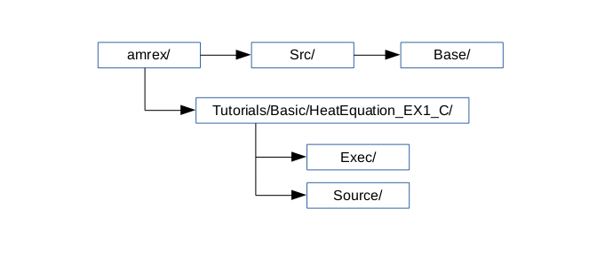

Example: HeatEquation_EX1_C
===========================

We now present an example of solving the heat equation.  The source
code tree for the heat equation example is simple, as shown in
:numref:`fig:Basics_Heat_flowchart`. We recommend you study
``main.cpp`` and ``advance.cpp`` to see some of the classes described
below in action.

.. raw:: latex

   \begin{center}

.. _fig:Basics_Heat_flowchart:

   Diagram of the source code structure for the HeatEquation_EX1_C example.

.. raw:: latex

   \end{center}

Source code tree for the HeatEquation_EX1_C example

    amrex/Src/Base
        Contains source code for single-level simulations.  Note that in
        ``amrex/Src`` there are many sub-directories, e.g., ``Base``, ``Amr``,
        ``AmrCore``, ``LinearSolvers``, etc.  In this tutorial the only source
        code directory we need is ``Base``.

    amrex/Tutorials/HeatEquation_EX1_C/Source
        Contains the following source code specific to this tutorial:

        #. ``Make.package``: lists the source code files
        #. ``main.cpp``: contains the C++ ``main`` function
        #. ``myfunc.cpp``: contains function ``advance`` that advances
           the solution by a time step, and function ``init_phi`` that
           initializes the initial solution.
        #. ``myfunc.H``: header file for C++ functions
        #. ``mykernel.H``: kernels functions called by ``advance`` and ``init_phi``.

    amrex/Tutorials/HeatEquation_EX1_C/Exec
        This is where you build the code with make.  There is a GNUmakefile
        and inputs file.

Now we highlight a few key sections of the code.  In ``main.cpp`` we
demonstrate how to read in parameters from the inputs file:

.. highlight:: c++

::

    // inputs parameters
    {
        // ParmParse is way of reading inputs from the inputs file
        ParmParse pp;

        // We need to get n_cell from the inputs file - this is the number of cells on each side of
        //   a square (or cubic) domain.
        pp.get("n_cell",n_cell);

        // The domain is broken into boxes of size max_grid_size
        pp.get("max_grid_size",max_grid_size);

        // Default plot_int to -1, allow us to set it to something else in the inputs file
        //  If plot_int < 0 then no plot files will be writtenq
        plot_int = -1;
        pp.query("plot_int",plot_int);

        // Default nsteps to 10, allow us to set it to something else in the inputs file
        nsteps = 10;
        pp.query("nsteps",nsteps);
    }

In ``main.cpp`` we demonstrate how to define a ``Box`` for the problem domain,
and then how to chop that ``Box`` up into multiple boxes that define a
``BoxArray``  We also define a ``Geometry`` object that knows about the problem
domain, the physical coordinates of the box, and the periodicity:

::

    // make BoxArray and Geometry
    BoxArray ba;
    Geometry geom;
    {
        IntVect dom_lo(AMREX_D_DECL(       0,        0,        0));
        IntVect dom_hi(AMREX_D_DECL(n_cell-1, n_cell-1, n_cell-1));
        Box domain(dom_lo, dom_hi);

        // Initialize the boxarray "ba" from the single box "domain"
        ba.define(domain);
        // Break up boxarray "ba" into chunks no larger than "max_grid_size" along a direction
        ba.maxSize(max_grid_size);

       // This defines the physical box, [-1,1] in each direction.
        RealBox real_box({AMREX_D_DECL(-1.0,-1.0,-1.0)},
                         {AMREX_D_DECL( 1.0, 1.0, 1.0)});

        // periodic in all direction by default
        Array<int,AMREX_SPACEDIM> is_periodic{AMREX_D_DECL(1,1,1)};

        // This defines a Geometry object
        geom.define(domain,real_box,CoordSys::cartesian,is_periodic);
    }

In ``main.cpp`` we demonstrate how to build a ``DistributionMapping`` from the
``BoxArray``, and then build ``MultiFabs`` with a desired number of components
and ghost cells associated with each grid:

::

    // Nghost = number of ghost cells for each array
    int Nghost = 1;

    // Ncomp = number of components for each array
    int Ncomp  = 1;

    // How Boxes are distributed among MPI processes
    DistributionMapping dm(ba);

    // we allocate two phi multifabs; one will store the old state, the other the new.
    MultiFab phi_old(ba, dm, Ncomp, Nghost);
    MultiFab phi_new(ba, dm, Ncomp, Nghost);

We demonstrate how to build an array of face-based ``MultiFabs`` :

::

    // build the flux multifabs
    Array<MultiFab, AMREX_SPACEDIM> flux;
    for (int dir = 0; dir < AMREX_SPACEDIM; dir++)
    {
        // flux(dir) has one component, zero ghost cells, and is nodal in direction dir
        BoxArray edge_ba = ba;
        edge_ba.surroundingNodes(dir);
        flux[dir].define(edge_ba, dm, 1, 0);
    }

To access and/or modify data in a ``MultiFab`` we use the ``MFIter``, where each
processor loops over grids it owns to access and/or modify data on that grid:

::

    // Initialize phi_new by calling a Fortran routine.
    // MFIter = MultiFab Iterator
    for ( MFIter mfi(phi_new); mfi.isValid(); ++mfi )
    {
        const Box& vbx = mfi.validbox();
        auto const& phiNew = phi_new.array(mfi);
        amrex::ParallelFor(vbx,
        [=] AMREX_GPU_DEVICE(int i, int j, int k)
        {
            init_phi(i,j,k,phiNew,dx,prob_lo);
        });
    }

Note that the kernel function ``init_phi`` for initializing a single
cell is is ``mykernel.H``.  It's marked with `AMREX_GPU_DEVICE` to
make it a GPU device function, if it built with GPU support.  It's
also marked with `AMREX_FORCE_INLINE` for inlining.

Ghost cells are filled using the ``FillBoundary`` function:

::

    // Fill the ghost cells of each grid from the other grids
    // includes periodic domain boundaries
    phi_old.FillBoundary(geom.periodicity());

---------

Temporarily Holding This Text Here

---------

.. _sec:heat equation:

Example: Heat Equation Solver
=============================

We now look at a more complicated example at
``amrex/Tutorials/Basic/HeatEquation_EX1_C`` and show how simulation results
can be visualized. This example solves the heat equation,

.. math:: \frac{\partial\phi}{\partial t} = \nabla^2\phi

using forward Euler temporal integration on a periodic domain.  We could use a
5-point (in 2D) or 7-point (in 3D) stencil, but for demonstration purposes we
spatially discretize the PDE by first constructing (negative) fluxes on cell faces, e.g.,

.. math:: F_{i+^1\!/_2,\,j} = \frac{\phi_{i+1,j}-\phi_{i,j}}{\Delta x},

and then taking the divergence to update the cells,

.. math::

   \phi_{i,\,j}^{n+1} = \phi_{i,\,j}^n
   + \frac{\Delta t}{\Delta x}\left(F_{i+^1\!/_2,\,j}-F_{i-^1\!/_2,\,j}\right)
   + \frac{\Delta t}{\Delta y}\left(F_{i,\,j+^1\!/_2}-F_{i,\,j-^1\!/_2}\right)

The implementation details of the code are discussed in section
:ref:`sec:basics:heat1`.  For now let's just build and run the code, and
visualize the results.

Building and Running the Code
-----------------------------

To build a 2D executable, go to
``amrex/Tutorials/Basic/HeatEquation_EX1_C/Exec`` and type ``make DIM=2``. This
will generate an executable named ``main2d.gnu.ex``. To run it, type,

.. highlight:: console

::

      ./main2d.gnu.ex inputs_2d

Note that the command takes a file ``inputs_2d.`` The calculation solves the
heat equation in 2D on a domain with :math:`256 \times 256` cells.  It runs
:math:`10,000` steps and makes a plotfile every :math:`1,000` steps.  When the
run finishes, you will have a number of plotfiles, ``plt00000, plt01000,`` etc,
in the directory where you are running.  You can control runtime parameters
such as how many time steps to run and how often to write plotfiles by setting
them in ``inputs_2d.``

Visualization
=============

There are several visualization tools that can be used for AMReX plotfiles.
One standard tool used within the AMReX-community is Amrvis, a package
developed and supported by CCSE that is designed specifically for highly
efficient visualization of block-structured hierarchical AMR data.  (Amrvis can
also be used to visualize performance data; see the :ref:`Chap:AMRex-based
Profiling Tools` chapter for further details.) Plotfiles can also be viewed
using the VisIt, ParaView, and yt packages.  Particle data can be viewed using
ParaView.  Refer to Chapter on :ref:`Chap:Visualization` for how to use each of
these tools.

