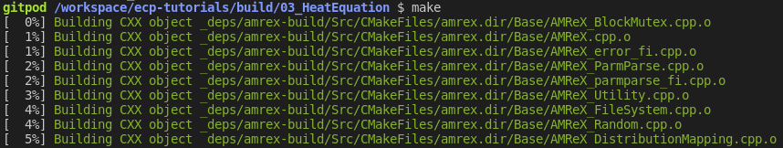
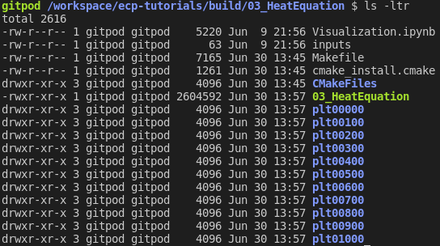
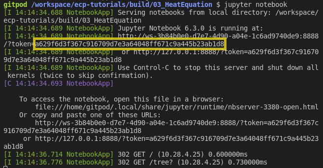
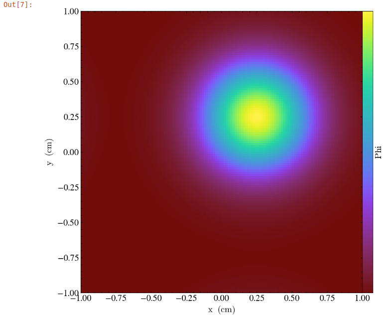

Tutorial: Heat Equation - Simple
==================================

.. admonition:: **Time to Complete**: 20 mins
   :class: warning

   - Compile an AMReX Code
   - Introduce Basic AMReX Elements
   - Generate and Visualize Output

In this tutorial we take the steps needed to go from source download to
visualized output of an AMReX code. We will demonstrate basic building,
compiling and output generation. We will also examine several key AMReX features
in a C++ code and plot the output with Python in a Jupyter notebook.

Setting Up Your Environment
~~~~~~~~~~~~~~~~~~~~~~~~~~~

This tutorial recommends using Gitpod (Requires a GitHub account).  Gitpod
provides an online terminal that is already preconfigured for our development
environment.

 Click |GitpodLink| to be taken to the Gitpod workspace.

.. |GitpodLink| raw:: html

   <a href="https://gitpod.io/#https://github.com/AMReX-Codes/amrex-tutorials" target="_blank">here</a>

..
    To download and build AMReX yourself see:
    https://amrex-codes.github.io/amrex/docs_html/GettingStarted.html
    and
    https://amrex-codes.github.io/amrex/docs_html/BuildingAMReX_Chapter.html

Building the Project
~~~~~~~~~~~~~~~~~~~~

This example will use CMake to build the project. Navigate to the directory
:code:`/workspace/amrex-tutorials`
and type

.. code-block::

   mkdir Build
   cd Build
   cmake ..

This will run CMake for all the tutorial directories. During this process
CMake will generate the build files it needs to compile each individual
tutorial.

More information about building options, such as disabling MPI, can be found at
https://amrex-codes.github.io/amrex/docs_html/BuildingAMReX_Chapter.html.

Compiling the Code
~~~~~~~~~~~~~~~~~~

After building the project, Navigate to the directory :code:`DemoTutorial1`.
At the prompt type :code:`make` and
CMake will compile the code and dependencies. The first time you call :code:`make`,
you should see a list of all the source AMReX files being compiled:

|

When CMake finishes you will be left with an executable named :code:`03_HeatEquation`.
To run the code type:

.. code-block::

   ./Basic_DemoTutorial1 inputs

This command will run the :code:`Basic_DemoTutorial1` code with the :code:`inputs` file as
the input parameters. Parsing of the information in the :code:`inputs` file is done by
:code:`ParmParse`. More details can be found at
https://amrex-codes.github.io/amrex/docs_html/Basics.html#parmparse

Code Highlights
~~~~~~~~~~~~~~~

At this point we have built, compiled and ran the :code:`Basic_DemoTutorial1` code. Now
we will walk through the code and explain some essential features of AMReX syntax.

Basic Structure
^^^^^^^^^^^^^^^
::

   Main
    ├──── Initialize AMReX
    ├──── Declare Simulation Parameters
    ├──── Read Parameter Values From Input File
    ├──── Define Simulation Setup & Geometry
    ├──── Initialize Data Loop
    │     └──── Set Values For Each Cell
    ├──── Write Initial Plotfile
    ├──── Main Time Evolution Loop
    │     ├──── Evolve Values For Each Cell
    │     ├──── Increment
    │     └──── Write Plotfile At Given Interval
    └──── Finalize AMReX

AMReX Namespace and Required Commands
^^^^^^^^^^^^^^^^^^^^^^^^^^^^^^^^^^^^^

The AMReX namespace contains many useful features. They are accessed by including
the necessary header files and using the
prefix :code:`amrex::`. Each
:code:`int main(...)` using AMReX should begin with :code:`amrex::Initialize()`
immediately followed by :code:`{`
and end with code:`}` immediately followed by :code:`amrex::Finalize()`. Together
these commands are responsible for
initializing the AMReX execution environment and proper release of resources. AMReX
classes and features not located between the commands will not function properly.

Other useful features include
:code:`amrex::Print()` which was written to handle print output during parallel
execution.

The MultiFab Data Structure
^^^^^^^^^^^^^^^^^^^^^^^^^^^

A :code:`MultiFab` is a data structure that AMReX can
distribute among parallel processes. In this Heat Equation example
we use two MultiFabs to hold the current and previous values of :math:`\phi`
as defined `here`_.

.. _`here` : https://amrex-codes.github.io/amrex/docs_html/GettingStarted.html#example-heat-equation-solver

The declaration of the first MultiFab for the previous values of :math:`\phi` is:

.. code-block::

  amrex::MultiFab phi_old(ba, dm, Ncomp, Nghost);

Here :code:`ba` is a `BoxArray`_ that stores a collection of boxes
on a single level of mesh refinement. :code:`dm` is a `DistributionMapping`_
that describes how to distribute processing across multiple CPUs and threads.
:code:`Ncomp` is the number of values stored for each cell of the mesh; in this case, 1
for the scalar :math:`\phi`. The value for :code:`Nghost` tells AMReX
how many `ghost cells`_ to create outside the box's valid region.

.. _`BoxArray`: https://amrex-codes.github.io/amrex/docs_html/Basics.html#boxarray

.. _`DistributionMapping`: https://amrex-codes.github.io/amrex/docs_html/Basics.html#distributionmapping

.. _`ghost cells`: https://amrex-codes.github.io/amrex/docs_html/Basics.html#ghost-cells

MFIter and ParallelFor
^^^^^^^^^^^^^^^^^^^^^^

Now we will examine the main time evolution loop. In this section AMReX's :code:`MFIter` and
:code:`ParallelFor` constructs work in conjunction to provide efficient parallel execution.
The code where this happens is:

.. code-block::

   for (int step = 1; step <= nsteps; ++step){

        phi_old.FillBoundary(geom.periodicity());

        for ( amrex::MFIter mfi(phi_old); mfi.isValid(); ++mfi ){

            const amrex::Box& bx = mfi.validbox();

            const amrex::Array4<amrex::Real>& phiOld = phi_old.array(mfi);
            const amrex::Array4<amrex::Real>& phiNew = phi_new.array(mfi);

            amrex::ParallelFor(bx, [=] AMREX_GPU_DEVICE (int i, int j, int k){

                phiNew(i,j,k) = phiOld(i,j,k) + dt *
                    ( (phiOld(i+1,j,k) - 2.*phiOld(i,j,k) + phiOld(i-1,j,k)) / (dx[0]*dx[0])
                     +(phiOld(i,j+1,k) - 2.*phiOld(i,j,k) + phiOld(i,j-1,k)) / (dx[1]*dx[1])
                     +(phiOld(i,j,k+1) - 2.*phiOld(i,j,k) + phiOld(i,j,k-1)) / (dx[2]*dx[2]) );

            }); // end ParallelFor
        }

        time = time + dt;
        amrex::MultiFab::Copy(phi_old, phi_new, 0, 0, 1, 0);
        amrex::Print() << "Advanced step " << step << "\n";

        if (plot_int > 0 && step%plot_int == 0){
            const std::string& pltfile = amrex::Concatenate("plt",step,5);
            WriteSingleLevelPlotfile(pltfile, phi_new, {"phi"}, geom, time, step);
        }
    }

First note the outer :code:`for` loop that counts the time step in our simulation. At each step
we begin by calling :code:`phi_old.FillBoundary(geom.periodicity())`. This fills ghost cells
based on the previous state of :math:`\phi` with periodic boundary conditions.

MFIter
""""""

The next :code:`for` loop,

.. code-block::

   for ( amrex::MFIter mfi(phi_old); mfi.isValid(); ++mfi )

uses the data object :code:`MFIter` to separate the mesh across processes for individual operations. Within this loop
the active piece of the mesh is defined by :code:`mfi.validbox()` and is accessed via :code:`bx` on the line,

.. code-block::

   const amrex::Box& bx = mfi.validbox();

In the next lines, the part of :code:`MultiFab` data that pertains to the current active
piece of the mesh is converted to an `Array4`_ data type for i,j,k access:

.. _`Array4`: https://amrex-codes.github.io/amrex/docs_html/Basics.html?highlight=array4#basefab-farraybox-iarraybox-and-array4

.. code-block::

   const amrex::Array4<amrex::Real>& phiOld = phi_old.array(mfi);
   const amrex::Array4<amrex::Real>& phiNew = phi_new.array(mfi);

ParallelFor
"""""""""""

:code:`ParallelFor` provides parallel execution of i,j,k operations that would otherwise require
three nested loops. This AMReX construct automatically adapts for efficient computation
based on the available hardware, including CPU and CPU+GPU variations.
In this example, it is here we compute the
forward Euler step (see `Heat Eqn`_) with the code:

.. _`Heat Eqn`: https://amrex-codes.github.io/amrex/docs_html/GettingStarted.html#example-heat-equation-solver

.. code-block::

   amrex::ParallelFor(bx, [=] AMREX_GPU_DEVICE (int i, int j, int k){

   phiNew(i,j,k) = phiOld(i,j,k) + dt *
      ( (phiOld(i+1,j,k) - 2.*phiOld(i,j,k) + phiOld(i-1,j,k)) / (dx[0]*dx[0])
      +(phiOld(i,j+1,k) - 2.*phiOld(i,j,k) + phiOld(i,j-1,k)) / (dx[1]*dx[1])
      +(phiOld(i,j,k+1) - 2.*phiOld(i,j,k) + phiOld(i,j,k-1)) / (dx[2]*dx[2]) );

   }); // end ParallelFor

The rest of the code in the main time evolution loop updates the time and
:code:`MultiFab` data, prints a status update to terminal, and writes
output to a plot file that will be used for visualization.

Visualizing Output
~~~~~~~~~~~~~~~~~~

Data Files
^^^^^^^^^^

In :code:`main.cpp` we called a plot function in two places. The
first time was to plot initial data.

.. code-block::

   129     if (plot_int > 0)
   130     {
   131         int step = 0;
   132         const std::string& pltfile = amrex::Concatenate("plt",step,5);
   133         WriteSingleLevelPlotfile(pltfile, phi_old, {"phi"}, geom, time, 0);
   134     }

The second time plots were generated at given intervals during
the main time progression loop.

.. code-block::

   171         if (plot_int > 0 && step%plot_int == 0)
   172         {
   173             const std::string& pltfile = amrex::Concatenate("plt",step,5);
   174             WriteSingleLevelPlotfile(pltfile, phi_new, {"phi"}, geom, time, step);
   175         }

Each time we run the code it will create a series of directories which contain
data for visualization. Now run :code:`03_HeatEquation` with the :code:`inputs`
file. After it finishes your directory should look like this.

Visualization in Jupyter
^^^^^^^^^^^^^^^^^^^^^^^^

We will use Python and the yt package in a Jupyter notebook to generate plots for the data
in the directories created in the previous step. First launch the Jupyter notebook
with the command:

.. code-block::

   jupyter notebook

When Jupyter starts, it will generate a token at the command line
and ask for a password in the window it opened. Copy the token
to enter to the notebook.

Once the notebook starts, find :code:`Visualization.ipynb` and open it.
In this file there are additional notes about the
heat equation example, followed by several cells that use :code:`yt`
commands to read AMReX output files.

yt
^^

The following commands import the :code:`yt` package and plot
a 2D slice of the output at from the 1000th time step.

.. code-block::

   import yt
   from yt.frontends.boxlib.data_structures import AMReXDataset
   ds = AMReXDataset("plt01000")
   sl = yt.SlicePlot(ds, 2, ('boxlib', 'phi'))
   sl

In our example, the commands are already written in the notebook.
To run them, select from the menu: `Kernel -> Restart & Run All`.
Once the run is complete, you will get the following plot.

What's Next?
~~~~~~~~~~~~

The code in this example was simplified down to a single file. Other convenient features
that require more complex syntax were removed for the sake of a
straight-forward presentation. In the next example
we'll put these pieces back and write code like an AMReX developer.
