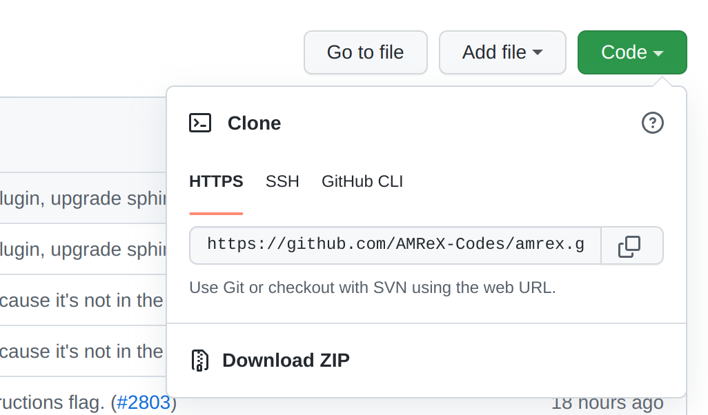

.. role:: cpp(code)
   :language: c++

.. _guided_hello_world:

HelloWorld with GNU Make
========================

.. admonition:: **Time to Complete**: 10 mins
   :class: warning

   **GOALS:**
     - Introduce Basic AMReX Elements
     - Compile with GNU Make
     - Compile and run with MPI for parallelization

This tutorial will walk through the steps involved for building AMReX ``HelloWorld``
with GNU make. Essential elements of the ``HelloWorld`` code will also be briefly
discussed. The source code of this example can be found  at ``amrex-tutorials/GuidedTutorials/HelloWorld/``
and is shown below.

.. figure:: images_tutorial/amrex-gnu-hello.gif
   :width: 90%
   :align: center
   :alt: gif showing gnu make build of HelloWorld example.

   Animation showing how to build the HelloWorld example.

HelloWorld Source Code
----------------------

The entire source code for the HelloWorld example is located in ``main.cpp``
and shown below.

.. code-block:: c++

   #include <AMReX.H>
   #include <AMReX_Print.H>

   int main(int argc, char* argv[])
   {
       amrex::Initialize(argc,argv);
       {
           amrex::Print() << "Hello world from AMReX version "
                          << amrex::Version() << "\n";
       }
       amrex::Finalize();
   }

The main body of this short example contains three statements.  Usually the
first and last statements for the :cpp:`int main(...)` function of every
program should be calling :cpp:`amrex::Initialize` and :cpp:`amrex::Finalize`,
respectively. The second statement calls :cpp:`amrex::Print` to print out a
string that includes the AMReX version returned by the :cpp:`amrex::Version`
function. Finally, the third statement calls :cpp:`amrex::Finalize` to clean up
data structures that are necessary for proper AMReX operation.

Notice the braces placed between :cpp:`amrex::Initialize` and
:cpp:`amrex::Finalize`. It is considered a good programming practice to insert
these braces such that it is guaranteed that anything executed in the code is
done after AMReX has been initialized, and before AMReX is finalized.

The example code includes two AMReX header files. Note that the name
of all AMReX header files starts with ``AMReX_`` (or just AMReX in the case of
AMReX.H). All AMReX C++ functions are in the :cpp:`amrex` namespace.

Getting the Code
-----------------

To run the HelloWorld example we will need the AMReX source code and the code
for the HelloWorld example. These two code sets can be conveniently downloaded
with Git. To check to see if Git is available on your local machine type
``git --version``. If needed,
`install git <https://git-scm.com/book/en/v2/Getting-Started-Installing-Git>`_.

Clone the AMReX Repo
^^^^^^^^^^^^^^^^^^^^

In a web browser, navigate to the `main AMReX repo <https://github.com/AMReX-Codes/amrex>`_.
Click the green code button, and select HTTPS from the dropdown window. You can copy
the html address of the repo by clicking on the overlayed squares next to it.

|

At a terminal, type the following:

.. code-block:: bash

   git clone https://github.com/AMReX-Codes/amrex.git

and Git will download the AMReX repo into the folder ``./amrex``.

.. note::

   Development is done off of the development branch (default). If instead,
   you want to install a release you can replace the command above
   with:

   .. code-block:: bash

      git clone https://github.com/AMReX-Codes/amrex.git --branch 22.06

Clone the AMReX-Tutorials Repo
^^^^^^^^^^^^^^^^^^^^^^^^^^^^^^

Next we will clone the AMReX-Tutorials repo. In order for the tutorial codes
to find the AMReX source code, it is necessary to clone the tutorials
directory at the same level as ``amrex``. i.e., we want a directory structure
like,

::

   Parent/
    ├──── amrex
    └──── amrex-tutorials

Alternatively, we can set the environment variable ``AMREX_HOME`` to the location of
the ``amrex`` directory.

At a terminal navigate to the parent directory above the directory for AMReX, and type:

.. code-block::

   git clone https://github.com/AMReX-Codes/amrex-tutorials.git

This will download the contents of the tutorials into a directory named
``amrex-tutorials``. At this point, we have all the source code we
need in place and can continue to the compile and run steps.

Compiling the Code with GNU Make
--------------------------------

Now move to the ``amrex-tutorials/GuidedTutorials/HelloWorld/`` directory to build the code.
Typing ``make`` will start the compilation process and result in an executable
named ``main3d.gnu.DEBUG.ex``. The name shows our example uses the GNU compiler with the debug
option set.  It also shows that the executable is built for
3D simulations. Although this simple example code is dimension independent, dimensionality
does matter for all non-trivial examples. The build process can be adjusted by
modifying the ``amrex-tutorials/GuidedTutorials/HelloWorld/GNUmakefile`` file.  More
details on how to build AMReX can be found in :ref:`Chap:BuildingAMReX`.

Running the Code
----------------

The example code can be run as follows,

.. highlight:: console

::

      ./main3d.gnu.DEBUG.ex

The result may look like,

.. code-block:: console

   AMReX (22.06-10-g18d0a2861d31) initialized
   Hello world from AMReX version 22.06-10-g8d0a2861d31
   AMReX (22.06-10-g18d0a2861d31) finalized

The version string means the current commit 8d0a2861d31 (note that the first
letter g in g8d0a... is not part of the hash) is based on 22.06 with 10
additional commits. If the version string contains "-dirty" as in
``22.06-10-g18d0a2861d31-dirty``, it means the AMReX work tree is dirty (i.e. there are uncommitted
changes).

In the GNU make file, ``GNUmakefile``,  there are compilation options for DEBUG mode (less optimized
code with more error checking), dimensionality, compiler type, and flags to
enable MPI and/or OpenMP parallelism.  If there are multiple instances of a
parameter, the last instance takes precedence.

Parallelization
---------------

Now let's compile the code to with MPI support by typing ``make USE_MPI=TRUE`` (alternatively you can
set ``USE_MPI=TRUE`` in the GNUmakefile). This should make an executable named
``main3d.gnu.DEBUG.MPI.ex``. Note MPI in the file name. You can then run,

.. code-block:: console

      mpiexec -n 4 ./main3d.gnu.DEBUG.MPI.ex amrex.v=1

The result may look like,

.. highlight:: console

::

      MPI initialized with 4 MPI processes
      AMReX (22.06-10-g18d0a2861d31) initialized
      Hello world from AMReX version 22.06-10-g18d0a2861d31
      AMReX (22.06-10-g18d0a2861d31) finalized

If the compilation fails, you are referred to :ref:`Chap:BuildingAMReX` for
more details on how to configure the build system.  The *optional* command line
argument ``amrex.v=1`` sets the AMReX verbosity level
to 1 to print the number of MPI processes used.  The default verbosity
level is 1, and you can pass ``amrex.v=0`` to turn it off.
More details on how runtime parameters are handled can be found in
section :ref:`sec:basics:parmparse`.

If you want to build with OpenMP, type make ``USE_OMP=TRUE``.  This should make
an executable named ``main3d.gnu.DEBUG.OMP.ex``. Note OMP in the file name.
Make sure the ``OMP_NUM_THREADS`` environment variable is set on your system.
You can then run,

.. highlight:: console

::

      OMP_NUM_THREADS=4 ./main3d.gnu.DEBUG.OMP.ex

The result may look like,

.. highlight:: console

::

      OMP initialized with 4 OMP threads
      AMReX (22.06-10-g18d0a2861d31) initialized
      Hello world from AMReX version 22.06-10-g18d0a2861d31
      AMReX (22.06-10-g18d0a2861d31) finalized

Note that you can build with both ``USE_MPI=TRUE`` and ``USE_OMP=TRUE``.  You
can then run,

.. highlight:: console

::

      OMP_NUM_THREADS=4 mpiexec -n 2 ./main3d.gnu.DEBUG.MPI.OMP.ex

The result will be,

.. highlight:: console

::

      MPI initialized with 2 MPI processes
      OMP initialized with 4 OMP threads
      AMReX (22.06-10-g18d0a2861d31) initialized
      Hello world from AMReX version 22.06-10-g18d0a2861d31
      AMReX (22.06-10-g18d0a2861d31y) finalized
